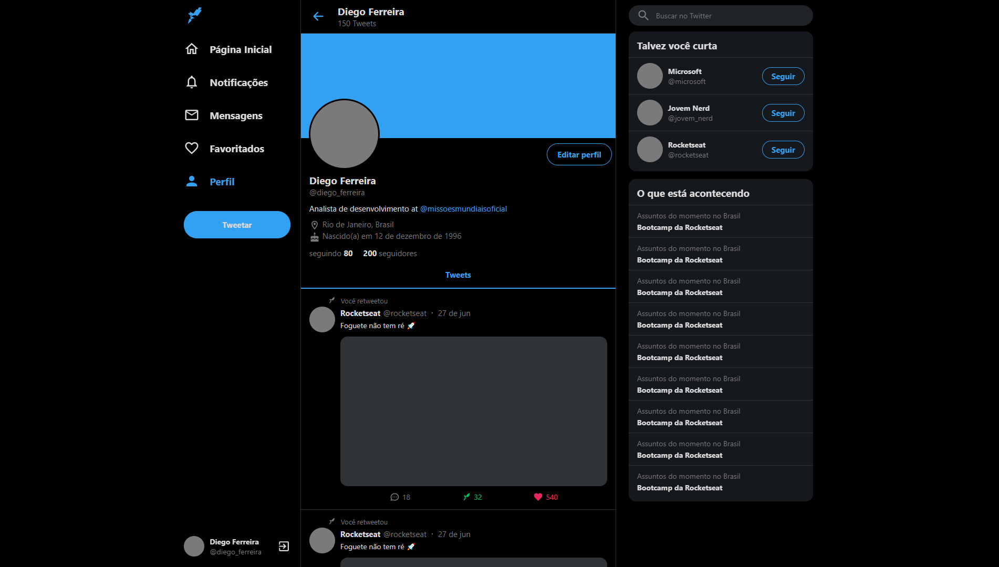

<h1 align="center">
  🐾 Clone do Twitter
</h1>

  <a href="#rocket-tecnologias">Tecnologias</a>&nbsp;&nbsp;&nbsp;|&nbsp;&nbsp;&nbsp;
  <a href="#-projeto">Projeto</a>&nbsp;&nbsp;&nbsp;|&nbsp;&nbsp;&nbsp;
  <a href="#-layout">Desenvolvimento</a>&nbsp;&nbsp;&nbsp;|&nbsp;&nbsp;&nbsp;
  <a href="#-layout">Referencia</a>&nbsp;&nbsp;&nbsp;|&nbsp;&nbsp;&nbsp;

 

  

## 📛 Tecnologias

Esse projeto foi desenvolvido com as seguintes tecnologias:

- React.Js
- TypeScript
- Styled Components

## 🏀 Projeto

O objetivo é clonar a interface Web do LinkedIn... os dados da aplicação Web são totalmente estáticos 

## 🎥 Referencia

Twitter Responsivo com ReactJS | UI Clone (Canal do YouTube da Rockseat)